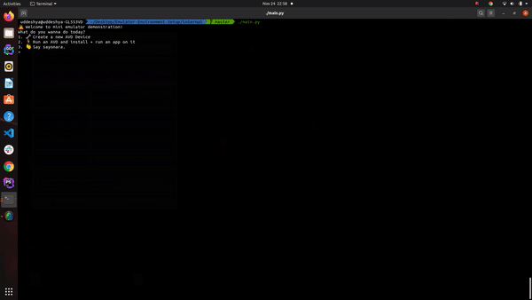

# Thanks for Reading my Blog!

The .zip file contains the legacy command line tools given to setup your emulator environment.
To setup your emulator environment correctly, please follow the blog instructions given in either of the 2 posts
- [Medium Post](https://singhuddeshyaofficial.medium.com/deploying-android-emulators-on-aws-ec2-1-3-arm-architecture-and-genymotion-solutions-for-a-2ef3238542d5)
- [Dev.to Post](https://dev.to/uds5501/deploying-android-emulators-on-aws-ec2-1-3-arm-architecture-and-genymotion-solutions-for-a-solo-developer-32p3)

# Using the emulator demo script (with autocompletion support)

Emulator CLI is generally boring and anyone in the automation team can say amen to the fact that staring at a non saucy and tedious CLI can be a tad bit unproductive. Here is my bit to make the terminal a colourful play ground, at least, in the terms of autocompletion behaviour which is more or less non existent in the traditional command line tools provided by our dear Android team.

The script uses the [prompt-toolkit](https://github.com/prompt-toolkit/python-prompt-toolkit) to implement interactive CLI experience for the user. You can check out the source code in the `internal` directory.

### Requirements to run the script in your system
- Make sure you follow the two blogs (links) and setup your local system accordingly.
- You'll need to put in APKs you want to test run on (You can find the 9gag apk used in the GIFs [here](https://apkpure.com/9gag-funny-gifs-pics-fresh-memes-viral-videos/com.ninegag.android.app))
- You'll need to run this `$ sdkmanager "build-tools;30.0.2"`
- You'll need to adjust your PATH by running `$ export $PATH=$PATH:~/build-tools`
- Then run `$pip3 install -r requirements.txt`

### Demo Run [Create new AVD]

This is the demo run for creating a new Android Virtual Device. I will be making a classic `android-28;google_apis;x86_64` virtual device with no modification in hardware specifications.

### Demo Run [Run AVD]

## Demo Run [Install and Run APK]

Tada! Thanks for reading the mini documentation!
